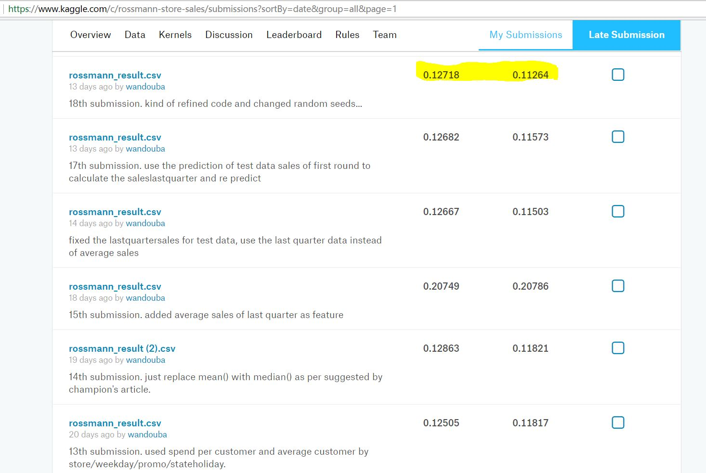

Rossmann Store Sales Prediction
=====

This is the graduation project for Udacity Machine Learning Nano Degree courses.

The project is coming from a Kaggle competition 2 years ago at: 
https://www.kaggle.com/c/rossmann-store-sales 

Rossmann operates over 3,000 drug stores in 7 European countries. In their first Kaggle competition, Rossmann is challenging you to predict 6 weeks of daily sales for 1,115 stores located across Germany.

All my entire thoughts, design and implementation process is in the [RossmannSalesPrediction.pdf](RossmannSalesPrediction.pdf)

Hardware
----

I'm using a Mi Air 2 laptop with 4GB Memory on WIndows  10

Libraries used
--
In this project I use XGBoost together with Numpy, Pandas. Matplotlib is used for visualization.

Training time
--
In my final model the training time is 364 seconds,  about 6 minutes.

Code
--
For full code please check my notebook: [rossmann_xgb.ipynb](rossmann_xgb.ipynb)

Dataset
--

Data set is also included as: [train.csv](train.csv), [store.csv](store.csv) and [test.csv](test.csv), 

Results
--
I submitted y result.csv to Kaggle to get the score. My best score is 0.112264:

